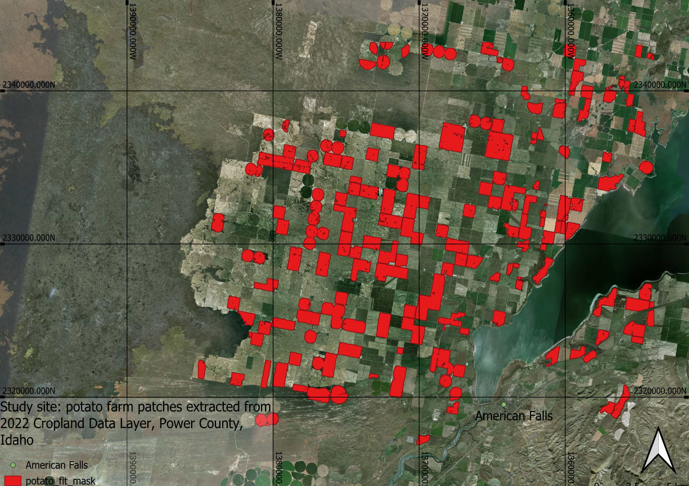

# Seed_to_harvest_process_monitoring
**Seed-to-Harvest Process Monitoring using Remote Sensing**


Agricultural processes exhibit unique levels of complexity and risk. Challenges of monitoring these processes arise from the diversity of environmental factors that can hit a field at any time and the fuzziness of the actual state of the crop. Precise capabilities of monitoring the seed-to-harvest process provides benefits for the management activities of the farmer as well as for partners such as financial institutions.
In this paper, we address the unique challenges of agricultural processes. More specifically, we introduce a novel technique for monitoring seed-to-harvest processes by help of satellite sensors. We provide a proof-of-concept implementation and evaluate it in a case study on publicly available farm data from the United States. The evaluation demonstrates the viability of process mining as a technique for automatic monitoring of seed-to-harvest processes.

This repository contains the implementation of "Seed-to-Harvest Process Monitoring using Remote Sensing". The paper was submitted to BPM 2024.

## Dependencies
* Python 3.11+
## Required packages
For required packages, please see [requirements.txt](requirements.txt).

To install all required packages: 
```
pip install -r requirements.txt
```
## Directories
### [Event_log](Event_log)
This directory contains the event log generated in this study.
### [Source](Source)
This directory contains the codes of this implementation.
## Codes
### Implementation
- `GEE_download.ipynb`: [Download time series data from Google Earth Engine](Source/GEE_download.ipynb)
    * To download data from GEE a GEE account is required. ([Sign up for GEE](https://earthengine.google.com/)) 
- `MACD_NDVI.ipynb`: [Event log generation](Source/MACD_NDVI.ipynb)
- `crop_prediction.ipynb`: [Crop rotation prediction](Source/crop_prediction.ipynb)
### Evaluation
- `pm4py_temporal.ipynb`: [Performance spectrum](Source/pm4py_temporal.ipynb)
- `smoothing_effect.ipynb`: [Smoothing assessment](Source/smoothing_effect.ipynb)
### Modules
- `seed_to_harvest.py`: [MACD activity recognition and event log enrichment](Source/seed_to_harvest.py)
- `rotation_prediction.py`: [Markov chain rotation prediction](Source/rotation_prediction.py)
## Event log
The generated event log has the following attributes:
| Attribute | Description | Type |
|:----------:|:----------:|:----------:|
| Activity| Activity recognized | str |
| Timestamp| Timestamp filtered based on VI likelihood | pandas datetime object |
| Time_uncertainty| All valid recognition timestamp | list of pandas datetime object |
| CaseID| ID given to the case structured as xxxx_yyyy. The first 4 digit represent the ID given to the site and the last 4 digit represent the year of the case | str |
| Crop| Cultivated crop | str |
| SiteID| ID given to the farm patch | int |
| WGS84_lon_lat| Center coordinate of the farm patch (WGS84) | list |
| County| County in which the farm patch is located determined by WGS84 coordinate | str |
| State| State/province in which the farm patch is located determined by WGS84 coordinate | str |
| Country| Country in which the farm patch is located determined by WGS84 coordinate | str |
| NDVI_range| Max/min range of valid recognition NDVI | list |
| num_valid_est| Number of valid recognition(s) | int |
## Overview
### Monitoring of Seed-to-Harvest Process
In this study we have constructed a framework for monitoring agricultural business process through satellite.

To evaluate our approach, we have conducted a case study for 148 farm patches in Idaho, United States. This case study studied 15 years of farming between 2007 and 2022. 

## License 
[LICENSE](LICENSE)