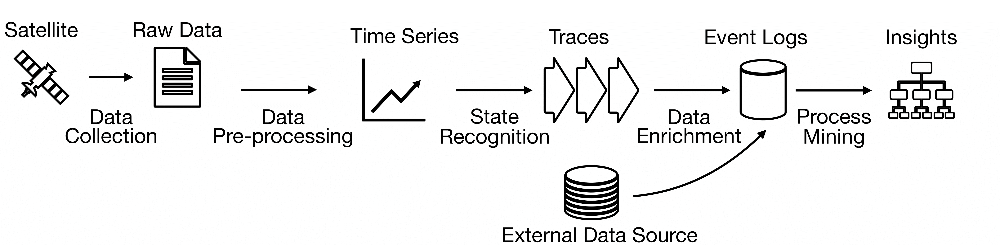

# Seed_to_harvest_process_monitoring
**Monitoring Cultivation Business Processes using Remote Sensing & Satellite Data**

Process mining has been intensively used for business processes that are extensively supported by information systems. The tight integration of in formation processing and process execution as leveraged in the service sector is however fully absent in agricultural processes such as land cultivation. Cultivation processes exhibit some challenging characteristics that make it difficult to monitor them in real-time: they unfold continuously over time, however with clearly identifiable states, while being exposed to the risk of various failure conditions that can hit any time. In this paper, we address the challenge of monitoring cultivation processes. We introduce a novel technique to generate event logs of seed-to-harvest processes as typical examples of cultivation with the help of satellite data. We evaluate our approach using publicly available data from the United States and demonstrate its validity.

**Framework**
In this study we have developed a framework for monitoring agricultural business process through satellite.

We have implemented our framework to investigate 15 years of agricultural activity from 2008 to 2022 on farm patches in Idaho, North Dakota, and Colorado, United States.


This repository contains the implementation of "Monitoring Cultivation Business Processes using Remote Sensing & Satellite Data"

## Dependencies
* Python 3.11+
## Required packages
For required packages, please see [requirements.txt](requirements.txt).

To install all required packages: 
```
pip install -r requirements.txt
```
## Directories
### [Event_log](Event_log)
This directory contains the main results.

Idaho:
- `log_Idaho_151024'_ALL.xes`: Seed to harvest event log saved in xes format
- `log_Idaho_151024'_ALL_df.h5`: Seed to harvest event log saved in h5 format

North Dakota:
- `log_NorthDakota_151024'_ALL.xes`: Seed to harvest event log saved in xes format
- `log_NorthDakota_151024'_ALL_df.h5`: Seed to harvest event log saved in h5 format


Colorado:
- `log_Colorado_151024'_ALL.xes`: Seed to harvest event log saved in xes format
- `log_Colorado_151024'_ALL_df.h5`: Seed to harvest event log saved in h5 format

### [Source](Source)
This directory contains the codes of this implementation.
## Codes
### Implementation
- `GEE_download.ipynb`: [Download time series data from Google Earth Engine](Source/GEE_download.ipynb)
    * To download data from GEE a GEE account is required. ([Sign up for GEE](https://earthengine.google.com/)) 
- `Eventlog_generation.py -site -[smoother='ALL']`: [Event log generation script](Source/Eventlog_generation.py)
    - `site`: Provide the case name to select the site. (The folder should share the same name).
    - `[smoother]` Select a smoothing method. 'ALL', 'BZP', 'SG', 'WE', 'None'. Default value is 'ALL'

### Evaluation and validation
- `Performance_spectrum_evaluation.py -site -[smoother='ALL']`: [Create performance spectrum](Source/Performance_spectrum_evaluation.py)
    - `site`: Provide the case name to select the site. (The folder should share the same name).
    - `[smoother]` Select a smoothing method. 'ALL', 'BZP', 'SG', 'WE', 'None'. Default value is 'ALL'
- `Smoothing_evaluation.py`: [Smoothing assessment](Source/Smoothing_evaluation.py)
- `Usual_dates.py -[smoother='ALL']`: [Validation through usual dates](Source/Usual_dates.py)
    - `[smoother]` Select a smoothing method. 'ALL', 'BZP', 'SG', 'WE', 'None'. Default value is 'ALL'
- `Monitoring.py -site -[year=2022] -[crop=None] -[filtering=None] -[width=1.5]`: [Simulate monitoring](Source/Monitoring.py)
    - `site`: Provide the case name to select the site. (The folder should share the same name).
    - `year`: Select a year (int).
    - `crop`: Subseting with specific crop (str).
    - `filtering`: If true remove of multiple crop cases, filter temporal outliers.
    - `width`: If `filtering` is true filter by IQE +/- `width`*IQR (flt).
### Modules
- `seed_to_harvest.py`: [MACD activity recognition and event log enrichment](Source/seed_to_harvest.py)

## Event log
The generated event log has the following attributes:
| Attribute | Description | Type |
|:----------:|:----------:|:----------:|
| Activity| Activity recognized | str |
| Timestamp| Timestamp filtered based on VI likelihood | pandas datetime object |
| Time_uncertainty| All valid recognition timestamp | List[pandas datetime object] |
| CaseID| ID given to the case structured as xxxx_yyyy. The first 4 digit represent the ID given to the site and the last 4 digit represent the year of the case | str |
| Crop| Cultivated crop | str |
| SiteID| ID given to the farm patch | int |
| WGS84_lon_lat| Center coordinate of the farm patch (WGS84) | list |
| County| County in which the farm patch is located determined by WGS84 coordinate | str |
| State| State/province in which the farm patch is located determined by WGS84 coordinate | str |
| Country| Country in which the farm patch is located determined by WGS84 coordinate | str |
| NDVI_range| Max/min range of valid recognition NDVI | list |
| num_valid_est| Number of valid recognition(s) | int |
| Multiple_crop| Binary indicator of whether multiple crop type was detected on field. 0: only one type of crop was found. 1: more than one types of crop were found. | int |

## License 
[LICENSE](LICENSE)